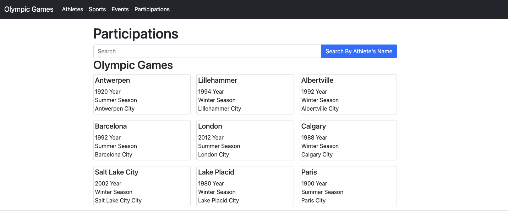

# BUILD: Project III / Design & Implement a Key-Value In-Memory Database

## **1. Documentation**
### **Business Requirement**
Our client is a sport event statistics committee who would like to have a database with information of Olympic Games during the past 120 years. Information they are interested in includes how many <mark>athletes</mark> _participated_ in a <mark>game</mark>, how many and <mark>teams</mark> _attended_ in a game, the number of <mark>medals</mark> for each team in a <mark>game</mark>, the athletes’ information like their <mark>age</mark>, <mark>weight</mark>, and <mark>height</mark>, the number of athletes in an event, how many athletes have participated in multiple Olympic Games, which athlete *won* the most medals in the history of Olympic Games in a certain <mark>event</mark>, the general trend of athlete’s <mark>body information</mark> along the years, as well as <mark>types of sports</mark> in different Olympic Games.

Nouns:
 
```athletes
teams 
game
medals
age
weight 
height
event
types
sports
body information
```
 

Verbs:
```participated
attended
won
```

### **Business Rules**
* A team could participate in multiple Olympic Games
* A team must participate in 1 Game to be recorded in the database.
* A team attending a Game must have at least 1 athlete.
* An athlete must participate in 1 Olympic Game to be recorded in the database.
* An athlete could participate in multiple events in an Olympic Games.
* An athlete could win several medals in 1 Game. 
* An athlete could participate in Olympic Games for different teams, for instance Mary could participated in 1992 Summer with Team US and with Team Japan in 1996 Summer.
* A Sport type could have multiple events
* An event must belong to a Sport type.
* A Game must have multiple teams participating.

### **Conceptual Model UML**
- [Project3 UML](https://lucid.app/lucidchart/47f13deb-0c7c-49cc-9430-6288f6ab24e9/edit?invitationId=inv_6602d40b-2285-42b7-b5b8-753d12cb2c87&page=7s0A5JmnN4Th#)

### **Added Functionalities Using Redis**
> Based on Project 2, where *Mongodb* was used as the main database, I will support a new function that allows users to get all the Olympic games an athlete has participated, and support CRUD the participation information in the database using *Redis*. After Redis makes the changes, it will update *Mongodb* database correspondingly.  

>Here, *Redis* serves as a cache to store only the athlete’s participation information to make the query and update super-fast.  The main intention behind the design aims to help data analytics or specialists who need to work on participation data frequently to do their job faster than working with *Mongodb*, where a lot of information is nested and requires aggregations to get participation information.


## **2. Redis Data Structures Used**
>I used 3 data structures in *Redis*: Sorted Set, Hash, and String.

- Sorted Set: “athleteName” as the key, “gameYear” as score and “gameYear gameSeason” as value. This way, particpation data could be represented in a chronological order.

- Hash: “gameId” as the key, “gameSeason” and “gameYear” as fields in the hash. This hash could help quickly get the information to populate the above sorted set.

- String, “gameYear gameSeason” as key and “gameId” as value for a fast fetch of gameId when deleting a participation in *Mongodb*.

## **3. Inplementation**
The code is in the file Code folder.
To run the program, please open a terminal, clone the repo, and follow the following steps.
1. Install proper packages:
```
npm install
```
2. Populate the Mongodb:
```
npm run initializeDB
```
3. Run the app:
```
cd Code
npm start
```
The added part for project 3 is a new page supporting CRD of participations of an athlete and U of athlete's name. The CRUD will update Redis first, and then make relevant changes in Mongodb.

Here is a screenshot of the participation page.


